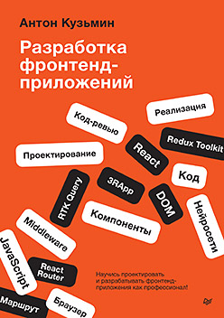

# Упражнения к книге "Разработка фронтенд-приложений"


Автор: Кузьмин Антон Геннадьевич

Издательство: "Питер"

ISBN: 978-5-4461-4272-9 

[Разработка фронтенд-приложений](https://www.piter.com/collection/new/product/razrabotka-frontend-prilozheniy "Разработка фронтенд-приложений") на сайте издательства "Питер"

## Дорогие читатели!
Типография напечатала книгу раньше, чем было запланировано. Не все упражнения ещё дописаны. Просим войти в положение. 

Сейчас доступны упражнения для подразделов: 2.3, 2.5, 2.6, 3.3 и 4.4, 4.5.

Ориентировочный срок выкладки всех упражнений 1 сентября 2025 года. 

В это время будут доступны упражнения для подразделов: 4.8, 4.9, 4.10, 4.11, 5.4-5.9, 5.11, 5.14, 5.15, 5.17, 5.19, 6.3, 6.4, 6.7, 7.1, 8.1, 8.3, 8.5 и 8.6

## Чтобы использовать упражнения
### Установите
1. Скачайте код на компьютер.
2. ```cd drills```
3. ```cd server``` ```npm i```
4. ```cd ..```
5. ```cd front``` ```npm i```

### Для выполнения упражнений
Нужно запустить приложение. Упражнения собраны в виде приложения. 
1. ```cd server``` ```node index```
2. ```cd ..``` ```cd front``` ```npm start```
